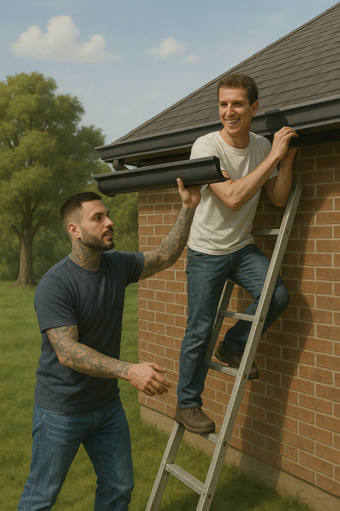

# Eavestrough Estimator



Estimate eavestrough requirements for Canadian buildings. Given an address, the tool:
1. Geocodes the address to coordinates
2. Queries OpenStreetMap for the building footprint
3. Calculates the perimeter and recommended eavestrough length (with 15% waste factor)
4. Displays a visualization

## Installation

```bash
pip install -e .
```

## Usage

```bash
python main.py "399 Tyee Rd"
```
